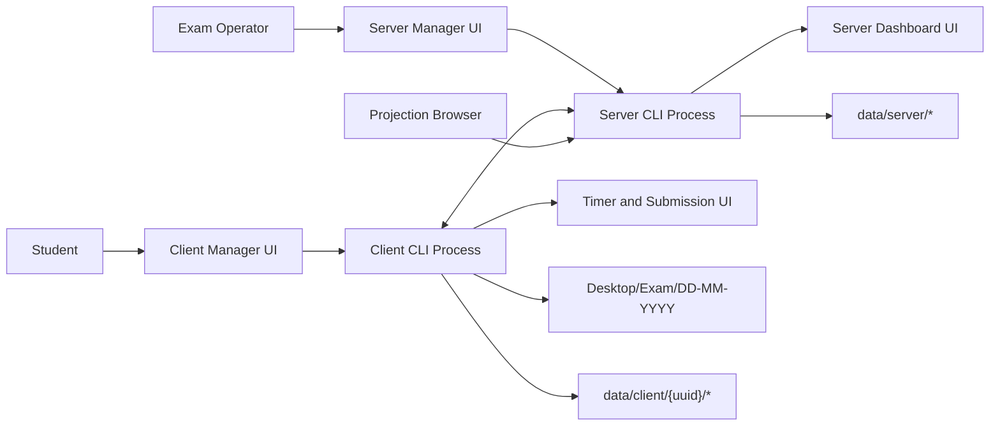

# 01. Project Overview

## Purpose

`May_04_Deniz` is a LAN-based exam runtime system. It supports a teacher or exam operator who runs a local server, students who run a local client, and optional GUI tools that make operation possible without typing every command manually. The server is authoritative for exam state, session state, policy, submissions, artifacts, incident history, and administrative actions. The client is responsible for authenticating the student, connecting to the selected server, enforcing the received policy locally, monitoring the local machine during the exam, reporting incidents, showing the timer and submission UI, and uploading final work.

The system is designed for a controlled lab or classroom network. It is not a public cloud service. It assumes that the server and clients are on a trusted local network, while still treating student machines as untrusted participants for policy and submission purposes.

## Product Goals

1. Provide a server that can register students, control exam start and finish, synchronize timer state, collect submissions, and store audit information.
2. Provide a client that can discover the server, authenticate, prepare exam materials, monitor local runtime behavior, and submit work.
3. Provide operator GUIs in both Tk and Qt so the same operational workflow works on environments where one UI stack is more stable than the other.
4. Preserve manual CLI workflows for development and emergency operation.
5. Keep local process IPC separated from the LAN student/server WebSocket protocol.
6. Make incidents actionable: detect them, persist them, display them, allow saved decisions, and apply configured actions.
7. Keep local monitoring alive across transient network disconnects so a reconnect does not erase evidence or stop logging.
8. Provide a read-only public-safe projector page for large-room notification display.

## Stakeholders

| Stakeholder | Interest |
| --- | --- |
| Exam operator | Needs reliable controls for start, finish, ban, kick, pause, resume, settings, incident review, and submissions. |
| Student | Needs a clear timer, start button, submission workflow, and exam files without needing server internals. |
| System administrator | Needs predictable local deployment, logs, auth controls, and no accidental public exposure of IPC. |
| Reviewer or evaluator | Needs requirements, design, interface, and validation documentation sufficient to judge correctness. |
| Future maintainer | Needs clear module boundaries, protocols, data contracts, and rebuild steps. |
| Future LLM agent | Needs compact structured context packs and traceability so changes can be made safely. |

## System Context

The LAN connection between the client process and server process carries authenticated exam runtime events. The local connections between managers, CLIs, dashboards, and timer windows use a different loopback-only IPC transport. The projector page is read-only HTTP/SSE and exposes only projection-safe aggregate state.

## Product Scope

In scope:

- Local server process with HTTP routes, WebSocket runtime, discovery beacons, duplicate-server guard, dashboard state, commands, persistence, shutdown handling, and projector page.
- Local client process with discovery, login, preflight authentication, exam preparation, WebSocket connection, reconnect loop, monitor ownership, incident engine, incident buffering, evidence upload retry, replay save queue, and submission upload.
- Tk and Qt UI implementations for launchers, server dashboard, policy/settings windows, incident/process decision dialogs, and client timer/submission windows.
- Shared modules for protocol encoding, secured payloads, local IPC, process definitions, incident rules, text safety, discovery, runtime logging, and port checks.
- Automated tests under `May_04_Deniz/tests`.

Out of scope:

- Public internet deployment.
- Multi-server federation.
- Browser URL extraction from Chrome, Edge, or Yandex. Browser approval is titlebar based.
- Third-party process control over FFmpeg stdin. FFmpeg remains a recorder dependency, not an app-owned IPC peer.
- Replacing the LAN WebSocket protocol with local IPC.

## Constraints

- Python is the implementation language.
- `aiohttp` is the HTTP, WebSocket, and SSE runtime dependency.
- `psutil` is used for process and hardware inspection.
- `cryptography` enables protected WebSocket message signing/encryption.
- `requests` and `beautifulsoup4` support CATS preflight behavior.
- `PySide6` is optional and required only for Qt UI mode.
- Windows is a primary target for focused-window and idle monitoring, but parts of the system are written with fallback behavior for other platforms.
- The server binds to a configurable LAN host and port; local IPC binds only to loopback.
- Documentation must be Markdown-only and editable.

## Operating Model

The server starts first. It loads persistent state from `data/server`, validates or initializes policy files, starts background tasks, optionally launches the dashboard GUI, and announces itself for discovery. A client manager starts the client CLI after collecting login information. The client locates the server by explicit host/port or discovery, checks server health, resolves authentication status, logs in, downloads configuration and exam materials, then opens a WebSocket runtime session.

During an exam, the client receives authoritative timer/session events but owns local observation. Process, focused-window, idle, hardware, exam-state, and replay logging are local responsibilities. If the network disconnects, the client marks the GUI as reconnecting and continues local logging. Incidents generated while offline are queued and retried after reconnect.

The server dashboard receives state snapshots from the server process through local IPC. Dashboard controls produce GUI command payloads that the server converts to the same admin command handlers used by the CLI. This keeps CLI and GUI behavior aligned.

## Major Feature Areas

| Area | Description |
| --- | --- |
| Server runtime | `server.main`, `server.app`, `server.handlers`, `server.tasks`, and `server.state` implement routes, WebSocket handling, state, commands, background broadcasting, GUI state, and persistence. |
| Client runtime | `client.main` and `client.ws_client` implement discovery, login, reconnect, WebSocket handling, monitor coordination, timer UI IPC, incident reporting, evidence, and submission. |
| Monitoring | Process, focused-window, idle, hardware, and replay modules capture local evidence and runtime logs. |
| Incident system | Client-side incident engine applies policy and incident rules; server persists reports, builds dashboards, acknowledges receipt, and applies configured actions. |
| Policy/settings | Server stores exam policy, process blacklist, process definitions, incident rules, operator defaults, and import/export bundles. |
| Local IPC | `common.ipc_ws` provides loopback WebSocket IPC with stdio fallback for local process control. |
| GUI | Tk and Qt launchers, server dashboards, policy windows, process/incident rule tabs, and student timer/submission windows. |
| Submission/artifacts | Client bundles final work with runtime files; server receives submissions and artifacts with checksum checks and file-size limits. |
| Projector | Server exposes `/projector` and `/projector/events` with public-safe aggregate notifications for low-resolution projection. |

## Success Criteria

The system is successful when:

- Operators can start the server, open a dashboard, configure policies, start and finish an exam, handle incidents, and retrieve submissions.
- Students can authenticate, connect, receive materials, start the timer, remain monitored, submit work, and recover from transient disconnects.
- Incidents are detected, persisted, acknowledged, displayed, and optionally converted into saved process or incident rules.
- Local logging and buffering survive reconnect attempts.
- Sensitive data is not shown on the projector page.
- The automated test suite passes for the current implementation.

## Historical Note

Earlier folders in the repository contain previous iterations, partial deliveries, or comparison artifacts. This report treats `May_04_Deniz/` as the only authoritative source for the current implementation. Historical folders may explain evolution, but they are not normative for current behavior.
