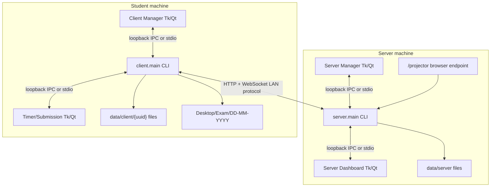
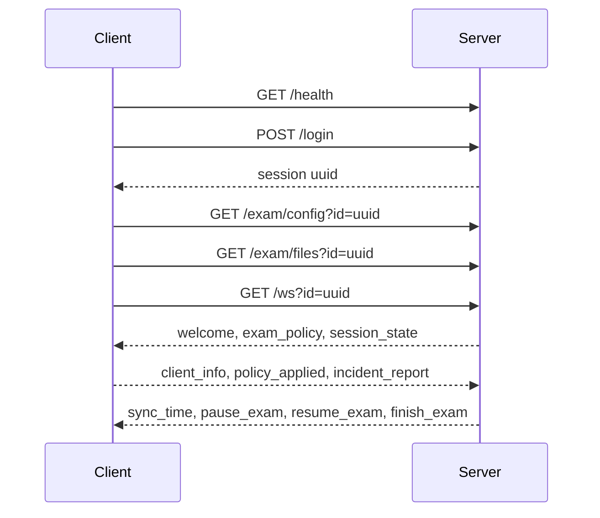
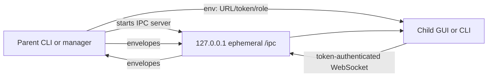

# 03. Software Architecture Document

## 1. Architectural Overview

The system is a distributed local exam application with one server process and one client process per student. It also starts local child GUI processes for operator and student interaction. The architecture uses two different communication planes:

1. LAN runtime plane: HTTP and WebSocket traffic between server and student clients.
2. Local process plane: loopback-only IPC between launcher/CLI/dashboard/timer processes on the same machine.

This separation is a core architectural rule. The LAN runtime plane carries exam protocol messages and is exposed on the configured server host/port. The local process plane is never intended for LAN exposure, binds only to loopback, and uses random per-process tokens.

## 2. Process Topology



The manager windows are convenience wrappers. They construct CLI commands, start child processes, capture logs, expose a console window, and send commands through the selected local IPC transport. The CLI processes remain the authoritative runtime owners.

## 3. Package Responsibility Model

### `common`

The `common` package contains contracts and utilities shared by server and client:

- `protocol`: JSON envelope encoding, checksum generation, checksum validation, integrity metadata preservation, ISO timestamps, and WebSocket URL UUID extraction.
- `events`: LAN WebSocket event names and constructors.
- `security`: session-specific signing/encryption envelope for sensitive events.
- `discovery` and `discovery_v2`: UDP discovery and duplicate-server detection support.
- `ipc_ws`: loopback-only WebSocket IPC and threaded wrappers for GUI/manager use.
- `process_definitions`: normalized process definitions, action flags, and process decision helpers.
- `incident_rules`: normalized incident rule definitions, matching, whitelist/warning/blacklist behavior, and incident-to-rule conversion.
- `text_safety`: Unicode display normalization, titlebar match normalization, and safe console text handling.
- `runtime_logging`: process-level stdout/stderr log capture.
- `stdio_compat`: fallback helpers for manual stdin/stdout mode.
- `server_ports` and `process_users`: local support utilities.

### `server`

The `server` package owns authority:

- `main`: command-line parsing, duplicate-server precheck, runtime logging setup, and `aiohttp.web.run_app`.
- `app`: `aiohttp` application factory, route registration, background task startup/cleanup, discovery announcer, GUI launch, and duplicate guard.
- `handlers`: HTTP route handlers, WebSocket connection handling, login/auth status, upload handling, secured message wrapping, incident handling, and process-action dispatch.
- `tasks`: time broadcasting, GUI state building, admin command parsing, dashboard request dispatch, policy broadcasts, global exam operations, auth bypass commands, user actions, and GUI process management.
- `state`: persistent state loading, normalization, versioning, policy composition, incidents, audit, settings import/export, and dashboard data derivation.
- `projector`: read-only projection HTML and SSE payload builder.
- `shutdown`, `submissions`, `settings_service`, `session_state`, and `ip_guard`: focused server services.
- `server/ui`: Tk and Qt dashboards, policy settings, row refresh helpers, dialogs, process database and incident rule UI helpers.

### `client`

The `client` package owns local student runtime behavior:

- `main`: discovery, login, exam preparation, reconnect loop, persistent recorder manager, and incident buffer ownership.
- `auth` and `preflight`: health/login calls, CATS/AD preflight, auth status fetch, strict fallback behavior, and temporary bypass interpretation.
- `exam`: exam config/material download and safe desktop extraction.
- `ws_client`: WebSocket session attempt, timer UI IPC, monitor lifecycle, server event handling, reconnect state, incident report sending, evidence retry, replay requests, and final submission coordination.
- `incidents`: local policy application and incident generation.
- `incident_buffer` and `outbound_buffer`: durable incident/evidence retry queues.
- `transfers` and `submission`: runtime bundle construction, archive preview, validation, checksum upload, and multipart posting.
- `custommodules`: process, focused-window, hardware, idle, and replay recorder modules.
- `client/ui`: Tk and Qt timer/submission windows.

### `launcher_ui` and `ui`

`launcher_ui` contains server/client manager windows in Tk and Qt. The shared `ui` package contains styling and reusable UI assets. Launchers are not protocol authorities; they start and supervise the CLI processes.

## 4. Communication Architecture

### 4.1 LAN Runtime Protocol

The server exposes HTTP routes for one-off operations and a WebSocket route for continuous exam runtime. JSON messages use:

```json
{
  "event": "event_name",
  "data": {},
  "checksum": "sha256-of-canonical-event-and-data"
}
```

The checksum is integrity protection against accidental or malformed message changes. Sensitive events can additionally be wrapped in a secured payload using `common.security`.



### 4.2 Loopback IPC

Loopback IPC uses `aiohttp` WebSocket on `127.0.0.1` with an ephemeral port. The parent process starts a local IPC server and passes URL, token, role, and transport through environment variables. Children connect only if the selected transport and env are present.



The envelope shape is documented in `05_interface_control_document.md`.

## 5. Data Architecture

Server-side persistent data is stored under `May_04_Deniz/data/server`. It includes users, incidents, process blacklist, process definitions, incident rules, exam policy, settings bundles, submissions, artifacts, and audit-like data. Client-side persistent data is stored under `May_04_Deniz/data/client/{uuid}` and includes runtime logs, monitor logs, buffers, recordings, exam files, and bundle staging.

The server is the authority for policy and session state. The client is the authority for raw local observation because only the student machine can observe its process list, focused window, idle state, hardware state, replay segments, and local files.

## 6. Deployment Model

The default deployment is:

- One server host on the LAN, default port `8080`, default server id `default`.
- Multiple clients connecting by server id discovery or explicit host/port.
- Optional Tk or Qt UI mode on both sides.
- Optional projector browser pointed at `http://<server-host>:<port>/projector`.

No external database, web framework, JavaScript framework, or cloud service is required.

## 7. Architectural Decisions

| Decision | Rationale |
| --- | --- |
| Use `aiohttp` for HTTP, WebSocket, SSE, and local IPC. | Avoids adding another WebSocket dependency and keeps async runtime consistent. |
| Keep LAN WebSocket and local IPC separate. | Prevents dashboard/manager control semantics from leaking into student/server protocol. |
| Preserve stdio fallback. | Keeps manual terminal operation and simpler debugging possible. |
| Persist policy and rule definitions as JSON files. | Supports operator editing, import/export, version stamps, and easy inspection. |
| Use client-side local monitoring. | Only the client machine can observe processes, windows, idle state, hardware, and replay. |
| Keep monitors alive across reconnect. | Prevents invisible monitoring gaps during network failures. |
| Make projector payload safe by construction. | A public classroom display must not expose private student or evidence details. |
| Provide Tk and Qt parity. | Windows deployments may differ in which UI backend is stable or installed. |

## 8. Quality Attributes

| Attribute | Architectural support |
| --- | --- |
| Reliability | Persistent state, reconnect loop, incident buffer, evidence retry, shutdown grace, duplicate-server guard. |
| Security | Auth secret support, secured sensitive WebSocket events, local IPC token and loopback checks, upload limits, safe ZIP extraction. |
| Privacy | Projector safe payloads, dashboard-only sensitive data, no public incident evidence exposure. |
| Maintainability | Package boundaries, shared protocol constructors, normalized policy/rule modules, tests by subsystem. |
| Operability | CLI commands, GUI controls, runtime logs, settings import/export, projector page, validation checklist. |
| Usability | Tk/Qt dashboards, timer UI, folder info buttons, smooth table refresh, large projector display. |

## 9. Rebuild Architecture Rule

When rebuilding or extending the system, implement in this order:

1. `common.protocol`, `common.events`, `common.security`, `common.ipc_ws`, text safety, process definitions, and incident rules.
2. Server state and persistence.
3. Server HTTP/WebSocket handlers.
4. Server background tasks and command dispatch.
5. Client authentication, discovery, exam preparation, and WebSocket session.
6. Client monitors, incident engine, incident buffer, replay, and transfers.
7. Tk/Qt UI surfaces and local IPC integration.
8. Projector endpoint and projection-safe payloads.
9. Tests and validation.
