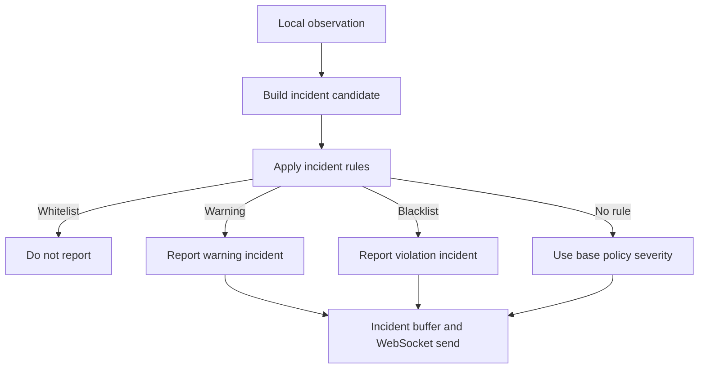
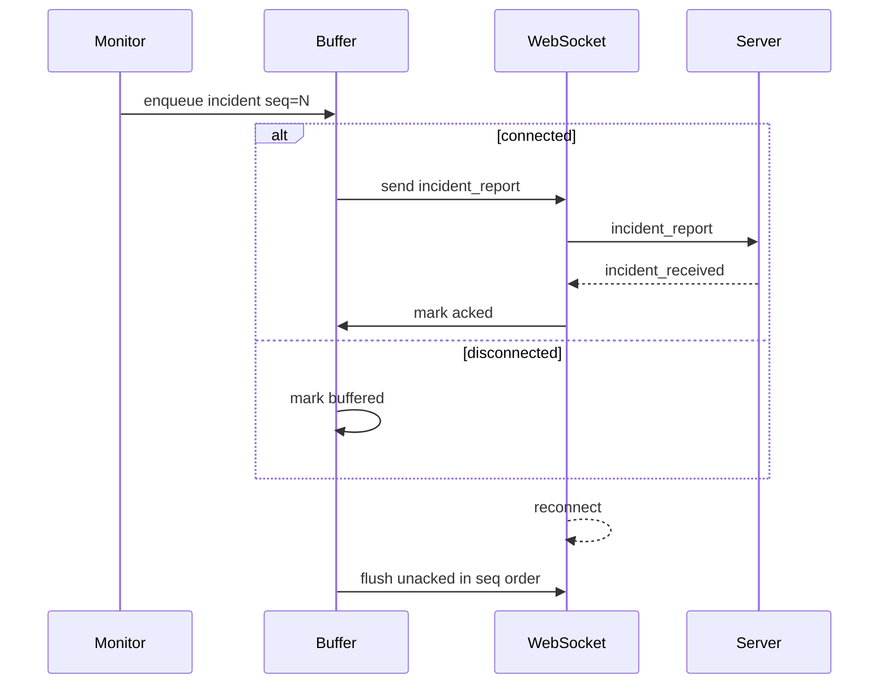
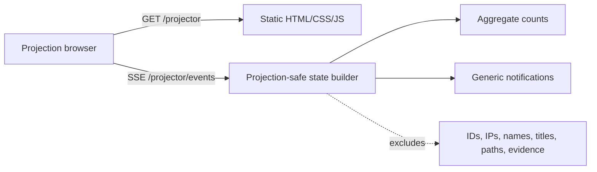

# 04. Software Design Document

## 1. Design Scope

This document explains the internal design of the current implementation. It is written for someone who must rebuild or modify the project, not only operate it. The design follows the module boundaries in `03_software_architecture_document.md` and connects them to requirement IDs from `02_srs.md`.

## 2. Shared Protocol Design

### JSON Envelope

All LAN WebSocket messages use `common.protocol.encode(event, data)` and `common.protocol.decode(raw)`. Encoding creates a JSON object with `event`, `data`, and `checksum`. Decoding rejects malformed JSON, missing checksum, non-object `data`, and checksum mismatch.

The protocol allows reliability metadata such as `seq`, `session_id`, `buffered`, and `queued_at` to appear at the top level or inside `data`. Those fields are preserved because buffered incident messages need stable identifiers across reconnects.

### Event Constructors

`common.events` is the only correct place to construct LAN event messages. The constructors centralize the exact event names and payload keys. Handlers on both sides compare against event constants rather than string literals where practical.

### Secured Payloads

`common.security` wraps selected events in a secured envelope. The session security context derives signing and encryption keys from the login password and session UUID. Secured payloads include timestamp, nonce, signature, encrypted flag, and either ciphertext or base64 payload. This design provides message integrity, replay protection, and optional confidentiality for sensitive event bodies.

## 3. Server Design

### App Creation

`server.app.create_app(args)` builds the `aiohttp.web.Application`. It loads users, stores runtime config in app keys, initializes auth bypass runtime state, registers all routes, and installs startup/cleanup callbacks. Startup creates background tasks for time broadcasting, console reading, discovery announcing, duplicate guard, and optional GUI launch.

### HTTP Handlers

`server.handlers` is split into route handlers and helper methods:

- Login validates payload, checks allowed users, handles auth token validation, applies banned/kicked/submission rules, and registers new users when allowed.
- Exam config returns server-side configuration needed by the client.
- Exam files streams configured ZIP materials.
- Submission and artifact upload handlers parse multipart data, enforce size limits, validate archive support, verify checksums, and store files.
- WebSocket handler validates session UUID, creates a client record, sends welcome/policy/session state, dispatches incoming events, and cleans up on disconnect.
- Auth status exposes server-side allow/deny information used by preflight.

### Server State

`server.state.ServerState` owns in-memory and persistent state. It loads JSON/text files, fills defaults, normalizes policy, version-stamps blacklist/process definitions/incident rules, persists incidents, stores audit entries, and builds settings bundles.

The state object deliberately keeps policy files and runtime client connection data separate. Users and incidents persist. Active WebSocket objects do not.

### Session State

`server.session_state` derives effective state from user flags and timing fields. This centralizes transitions such as running, paused, awaiting submission, submitted, banned, and kicked. Server handlers and dashboard builders use the same derivation so UI and protocol state remain aligned.

### Background Tasks

`server.tasks.time_broadcaster(app)` periodically:

- Sends remaining time/session messages to connected clients.
- Ends sessions whose timers expire.
- Pushes dashboard state to GUI IPC.

The same module handles command parsing. Commands from stdin and dashboard GUI requests converge into `handle_admin_command` or dedicated GUI request handlers. This prevents GUI behavior from drifting away from CLI behavior.

### Dashboard State

Dashboard state is a server-side aggregate. It contains clients, incidents, process database rows, incident rule rows, server info, settings snapshots, folder paths, auth status, and command results. It is sent through local IPC on `server.dashboard_state`; it is not sent to student clients.

## 4. Client Design

### Main Loop And Session Ownership

`client.main.main_loop(args)` owns runtime objects that must survive reconnect attempts. It creates a persistent `IncidentBuffer` and a persistent `RecorderManager`. It discovers or resolves the server, establishes a session, prepares client files/materials, and then repeatedly runs WebSocket session attempts until shutdown conditions are met.

The key design rule is that `WebSocketSession` is connection-attempt scoped. It owns the active socket and event handling for the current connection. It does not own the entire local monitoring lifecycle in a way that would destroy logs on reconnect.

### Exam Preparation

`client.exam.fetch_exam_prep` retrieves server config and exam files. ZIP materials are stored under `data/client/{uuid}/exam_files/` and extracted to `Desktop/Exam/DD-MM-YYYY`. Extraction rejects absolute paths, drive-letter paths, traversal, and unsafe member names. A manifest marker distinguishes app-managed folders from user-created folders.

### Timer And Submission UI

The timer UI is a child process. It receives state lines or local IPC messages such as remaining time, pause/resume, finish prompt, upload status, and `EXAM_FILES` JSON. It sends commands back for start and finish actions. Tk and Qt implementations are intentionally feature-parallel.

### Monitors

The client uses dedicated monitor classes:

- Process monitor: logs process full snapshots/diffs, blacklist matches, and process observations.
- Focused-window monitor: logs active window snapshots and sanitizes titles.
- Idle monitor: logs idle seconds and state markers.
- Hardware monitor: logs full snapshots and changes for disks, interfaces, memory, battery, and machine data where available.
- Replay recorder: maintains FFmpeg screen segments and saves request-specific replays.
- Exam state logger: records timer state transitions and reconnect markers.

Each monitor writes JSONL or artifact files under client data so evidence can be included in submission or incident bundles.

## 5. Incident Engine Design

`client.incidents.ClientIncidentEngine` applies the current policy snapshot to process, focused-window, idle, rapid-switching, unexpected-process, and process-definition observations.

The engine creates incident candidates with rule id, event type, source, severity, summary, process/window/pid context, and action metadata. Before a candidate is reported, incident rules are applied:

1. Normalize incoming incident rule definitions.
2. Find matching rules by event/source/process/title/browser fields.
3. Prefer whitelist rules by priority.
4. Suppress incident if whitelist matches.
5. Override severity and attach configured actions if warning/blacklist matches.
6. Leave incident unchanged if no matching rule exists.

This design converts titlebar matching from a global string list into a definition-based policy system while keeping legacy focused-window allowed/blocked lists as compatibility inputs.

## 6. Reconnect And Buffer Design

`client.incident_buffer.IncidentBuffer` persists incident packets and evidence status under `data/client/{uuid}/buffer/{timestamp}`. Each packet receives a stable sequence number, queued timestamp, buffered flag, and incident id. Sent-but-unacknowledged packets remain retryable until the server returns `incident_received`.

Evidence retry is separate from incident retry. A report may be acknowledged while evidence upload is still pending; the evidence status log allows later retries.

## 7. Submission And Artifact Design

Submissions and artifacts are transferred as multipart HTTP uploads. The client builds ZIP bundles that include selected student work and runtime files. Runtime file collection is best-effort: a missing or temporarily locked log should not destroy the entire submission. The server enforces size limits and checksum validation where checksums are provided.

Incident artifacts and replay saves use similar upload infrastructure but target the artifact route and incident acknowledgement flow. This keeps final submission and incident evidence logically distinct.

## 8. Auth And Preflight Design

The client preflight layer asks the server for `/auth/status?login_id=<id>` before deciding whether local CATS or AD checks can be skipped. If this request fails, the client uses strict local behavior. The server remains the authority for temporary bypass windows. AD bypass does not mean anonymous login; it only changes token expectations for allowed login IDs and still requires a nonempty password.

Bypass commands are runtime-only:

- `/disablecatsauth [seconds]`
- `/disableadauth [seconds]`
- `/enablecatsauth`
- `/enableadauth`
- `/authstatus`

## 9. Local IPC Design

`common.ipc_ws` provides:

- Async server/client primitives for loopback WebSocket IPC.
- Threaded wrappers for GUI frameworks that are not async-first.
- Transport selection helpers.
- Envelope creation and validation.
- Child environment generation.

Transport selection rules:

- `ws`: require WebSocket IPC.
- `stdio`: use stdin/stdout compatibility.
- `auto`: use WebSocket IPC when `EXAM_LOCAL_IPC_URL` and `EXAM_LOCAL_IPC_TOKEN` exist; otherwise use stdio.

## 10. GUI Design

Tk and Qt dashboards use the same conceptual screens:

- Overview and server info.
- Clients table.
- Incident history.
- Process database.
- Incident rules.
- Settings/policy.
- Command console and action buttons.

Smooth refresh helpers compare row snapshots and update cells in place where row identity/order is stable. Timer countdowns update remaining-time cells without rebuilding entire tables. When full rebuild is unavoidable, selection, focus, and scroll position are preserved.

Client timer UIs show the timer state, start action, upload/finish workflow, and exam-folder button. Submission windows preview files/archives and send finish commands back to the client process.

## 11. Projector Design

`server.projector` builds a projection-safe state payload:

- server time
- exam phase
- exam start enabled flag
- connection status
- counts for total, connected, disconnected, active incidents, warnings, violations, submitted, and awaiting submission
- recent public notifications

The HTML is self-contained and uses `EventSource('/projector/events')`. It is intentionally read-only: no forms, buttons, commands, tokens, or mutation endpoints are exposed. Notification text is generic by construction.

## 12. Design Traceability Summary

| Design area | Requirement IDs |
| --- | --- |
| Server app/routes/state/tasks | `FR-SRV-*`, `FR-POL-*`, `FR-AUTH-*` |
| Client main/ws/preflight/exam | `FR-CLI-*`, `FR-AUTH-*`, `FR-REC-*` |
| Monitoring and incident engine | `FR-MON-*`, `FR-INC-*` |
| Submission and artifacts | `FR-SUB-*` |
| Local IPC and GUI | `FR-IPC-*`, `FR-UI-*` |
| Projector | `FR-PROJ-*`, `NFR-PRIV-*`, `NFR-UX-*` |
| Security | `NFR-SEC-*` |
