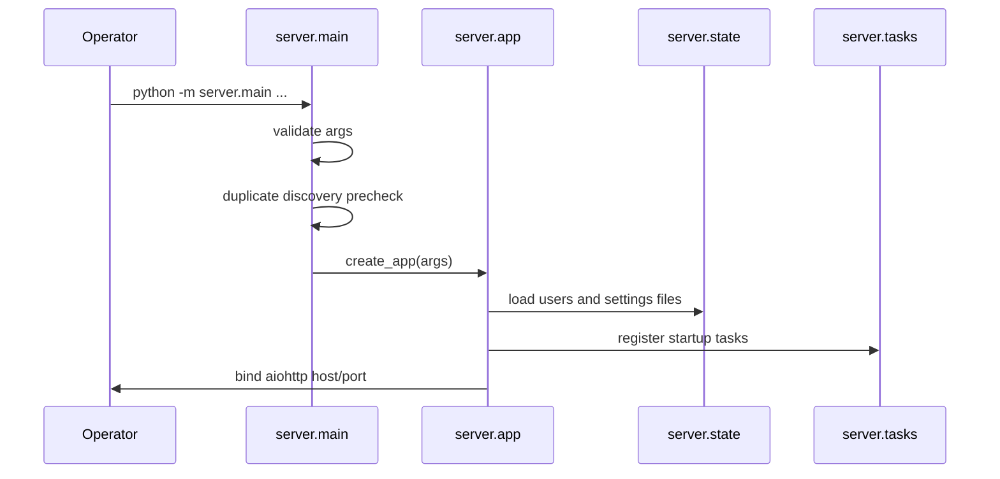
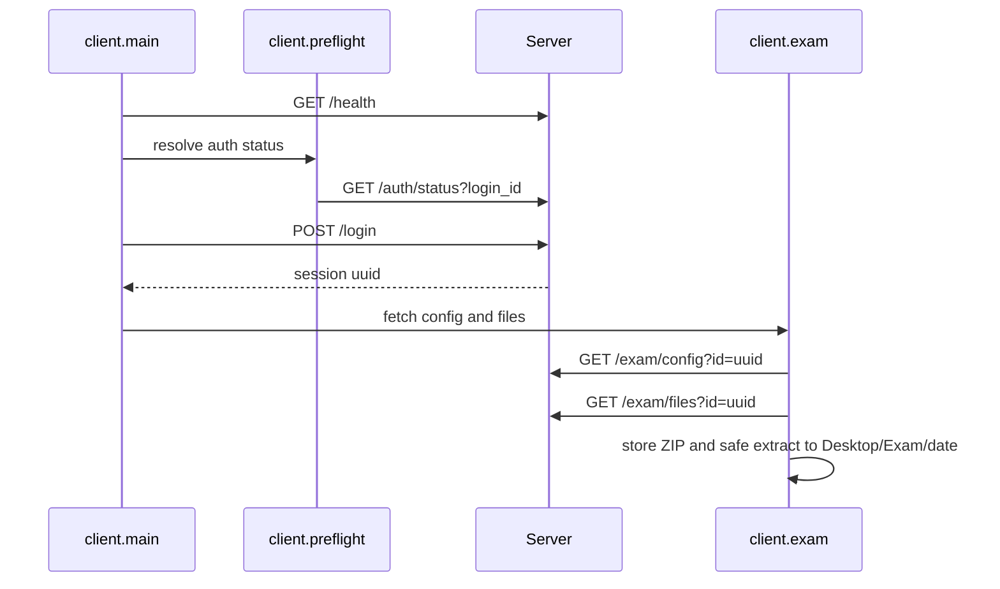
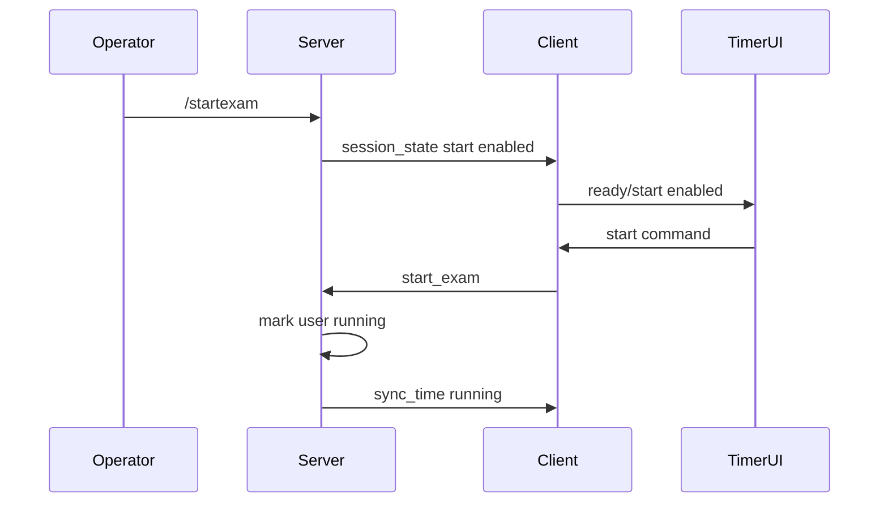
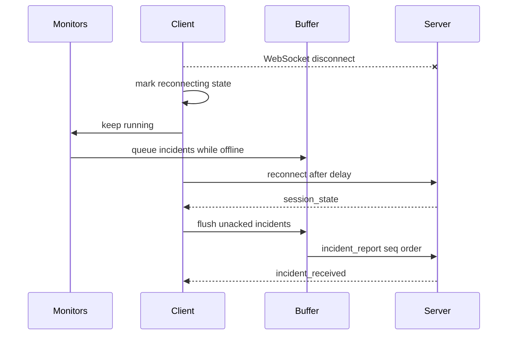
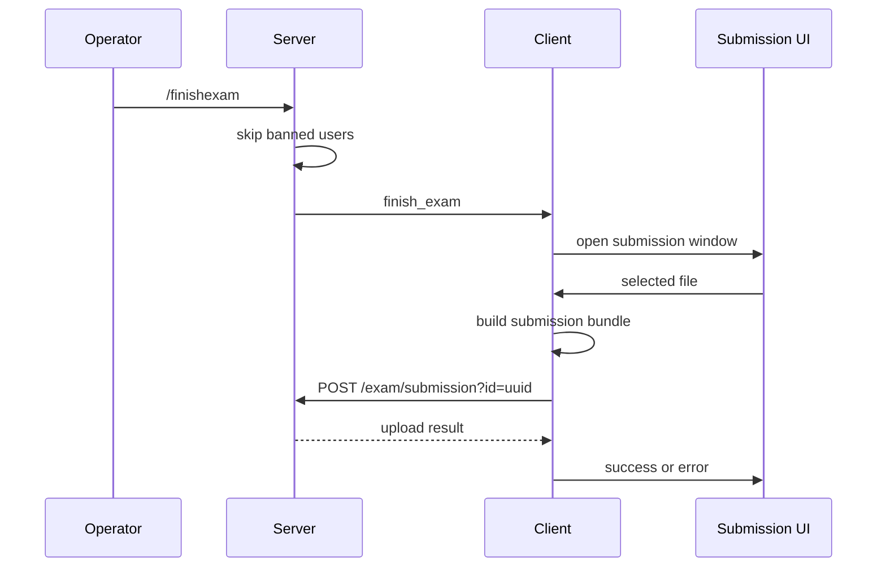

# 06. Runtime Sequences

## 1. Server Startup

1. Runtime logging is initialized under `data/logs/server`.
2. CLI arguments are parsed and validated.
3. Optional reset clears persistent user state.
4. Duplicate server discovery checks for another server with the same id.
5. `create_app` loads state, stores configuration, registers routes, and prepares background tasks.
6. Startup tasks begin time broadcasting, stdin/IPC command reading, discovery announcement, duplicate guard, and optional dashboard GUI.

## 2. Client Manager Login And Runtime Launch

1. Student opens Tk or Qt client manager.
2. Manager collects login id, password, server id or host/port, UI backend, auth options, and recorder option.
3. Manager can run check-login mode before full launch.
4. Manager starts `client.main` as a child process.
5. Manager passes local IPC environment if WebSocket IPC is selected.
6. Manager captures child stdout/stderr for operator/student visibility.

## 3. Client Discovery, Login, And Preparation

If direct host is not provided, discovery resolves the host and port by server id. If `/auth/status` fails, local auth behavior stays strict. After login, the session UUID becomes the key for config, exam files, WebSocket connection, client data folder, and uploads.

## 4. WebSocket Connect And Policy Sync

1. Client opens `GET /ws?id=<uuid>`.
2. Server validates UUID and creates/updates the connected client entry.
3. Server sends `welcome`.
4. Server sends `exam_policy` and `process_blacklist`.
5. Server sends `session_state` for the current user.
6. Client creates or updates a security context when applicable.
7. Client applies policy to incident engine and monitors.
8. Client sends `policy_applied`.
9. Client sends `client_info` with machine metadata.
10. Client syncs timer UI state.

## 5. Exam Start

The server controls whether starting is allowed. The student action starts the individual session timer only after the server phase permits it.

## 6. Timer Sync, Pause, Resume, And Add Time

The server periodically calculates remaining seconds from session timestamps and offsets. It sends `sync_time` to running sessions. Paused sessions keep a stored remaining time and pause reason. Operator commands:

- `/addtime <id> <minutes>` adjusts the user's timer.
- `/pauseexam <id>` sends `pause_exam` and updates state.
- `/resumeexam <id>` sends `resume_exam` and resumes countdown.

Timer UI receives state through local IPC or stdio and updates display without owning the authoritative timer.

## 7. Reconnect Flow

Disconnect is treated as a network state, not a local shutdown. The recorder, monitors, GUI bridge, exam-state logger, incident engine, and buffers remain active until final submission, intentional shutdown, or process exit.

## 8. Monitoring And Incident Detection

1. Monitors emit observations at their configured intervals.
2. `ClientIncidentEngine` applies the current policy snapshot.
3. Process blacklist, process definitions, focused-window, rapid-switching, idle, unexpected-process, and path clarification rules may produce candidates.
4. Incident rules are applied before reporting.
5. Whitelist rules suppress matching candidates.
6. Warning/blacklist rules override severity and attach configured actions.
7. Incidents are queued in `IncidentBuffer`.
8. If connected, incidents are sent immediately.
9. If disconnected or send fails, incidents remain buffered.

## 9. Server Incident Handling

1. Server receives `incident_report`.
2. Handler validates payload and active session context.
3. Incident is appended to persistent incident history.
4. Active incident state and per-user summary are updated.
5. Server sends `incident_received`.
6. Configured actions may be applied:
   - ban user
   - kick user
   - pause exam
   - kill process id when a live pid and connected client exist
7. Dashboard state refresh shows active/history rows.
8. Projector receives only generic notification text and aggregate counts.

## 10. Evidence Upload

1. Client generates an artifact bundle or replay file for an incident.
2. Client posts multipart data to `/client/artifact?id=<uuid>`.
3. Server verifies upload constraints and stores artifact.
4. Server acknowledges the associated incident with artifact path internally.
5. Client marks evidence complete.
6. If upload fails while disconnected, pending evidence status is persisted and retried.

## 11. Save Screen And Replay

1. Operator issues `/savescreen <id>` or `/savescreen all`.
2. Server sends `savescreen` with request id and timestamp.
3. Client replay queue asks recorder to save the relevant recent segments.
4. Recorder stitches MP4 when possible.
5. If MP4 stitching fails or produces incomplete output, MPEG-TS fallback is used.
6. Artifact upload sends saved replay to server.

## 12. Final Exam Finish And Submission

Banned users are not moved to awaiting-submission by global finish. Connected non-banned users receive finish prompts. Disconnected users retain state for later handling according to server state and policy.

## 13. Settings And Policy Update

1. Operator edits settings in GUI or file.
2. GUI sends `save_settings` or CLI applies policy/blacklist/definitions/rules.
3. Server normalizes settings and writes files.
4. Version stamps update.
5. Server broadcasts `policy_update`, `process_blacklist`, and session state as needed.
6. Clients apply new policy and acknowledge with `policy_applied`.
7. Dashboard settings snapshot refreshes.

## 14. Process Database Decision

1. Dashboard builds rows from process observations and definitions.
2. Operator opens a decision dialog.
3. Operator chooses status/actions and whether to save decision.
4. GUI sends `apply_process_decision`.
5. Server updates process definitions and/or applies live actions.
6. Policy update broadcasts revised definitions.

## 15. Incident Rule Decision

1. Dashboard incident history or Incident Rules tab produces a candidate row.
2. Operator opens incident rule decision dialog.
3. Operator selects status, match fields, action toggles, and save-to-policy behavior.
4. GUI sends `apply_incident_rule_decision`.
5. Server updates `incident_rules.json` when requested.
6. Client policy update causes future matching incidents to be suppressed, downgraded, or escalated according to the saved rule.

## 16. Auth Bypass Sequence

1. Operator runs `/disablecatsauth [seconds]` or `/disableadauth [seconds]`.
2. Server stores runtime expiry time.
3. Client preflight requests `/auth/status?login_id=<id>`.
4. Server returns whether bypass is currently active.
5. Client skips only the allowed local preflight portion.
6. Server accepts AD bypass login only for allowed users and nonempty passwords.
7. Expiry automatically returns behavior to strict auth.

## 17. Local IPC Startup

1. Parent process selects transport.
2. If WebSocket IPC is used, parent starts `LocalIpcServer` on loopback ephemeral port.
3. Parent passes URL, token, role, and transport env vars to child.
4. Child connects with token.
5. Parent and child exchange channel envelopes.
6. If IPC env is absent in `auto`, child uses stdio-compatible line handling.

## 18. Projector Feed

1. Browser requests `/projector`.
2. Server returns a self-contained page.
3. Page opens `EventSource('/projector/events')`.
4. Server periodically builds projection-safe state.
5. Browser renders phase, counts, and newest generic notifications.
6. Browser displays reconnecting status if SSE stops.

## 19. Shutdown

1. Operator stops server or process exits.
2. Cleanup routine runs shutdown grace behavior.
3. Background tasks are cancelled.
4. Discovery announcer stops.
5. GUI process is killed if still running.
6. GUI IPC server stops.
7. Clients detect WebSocket closure and either reconnect or finish depending on runtime state.
